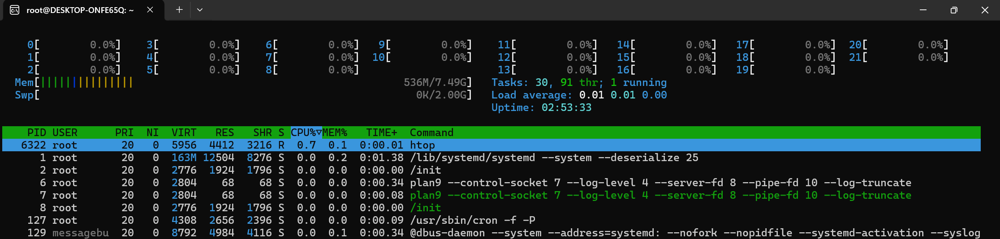
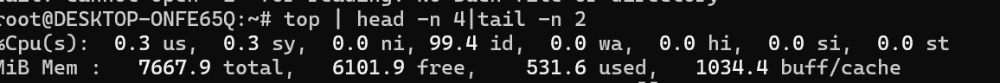

## 1. System Monitoring
### Install and configure monitoring tools: htop or nmon


```bash
sudo apt update
sudo apt install htop nmon -y
```

### Script: `monitor_du.sh`

This script logs:
- Disk usage (`df -h`)
- Home directory usage (`du -sh`)
- Top 10 CPU-consuming processes  (` ps command I have used  Or top also we can use | htop is interactive tool and hard to  script ` )
- Top 10 memory-consuming processes ( `ps` )
### Steps:
1. Create a directory to store system informations
``` bash
mkdir -p "$HOME/system_monitor"
```
2. Configure a cron job to get the system details at every 10 min and update the log files
   ```bash
   */10 * * * * /bin/bash $HOME/system_monitoring.sh
   ```

3. Data captured :
   - capture disk space usage in a human-readable format [df -h]
   - Capture disk  usage of home directory in a human-readable format [du -sh $HOME/* ]
   - Capture top 10 CPU and Memory consuming process running [ we can using ps or top commands for scripting ] .
     #### As we are supposed use htop capture the CPU and MEM details , but htop is an interactive monitoring tool. Tried using htop -b command but we getting -b invalid option' as batch mode (-b) is supported in htop v2.0+. Version I'm using was 3.0.5.  
4. Log files are saved in:**  
`~/system_monitor/system_info_<YYYY-MM-DD>.log`

#### Usage

```bash
sh monitor_du.sh
```

#### Automate with Cron

To run the script every 10 min, add to your crontab:

```bash
crontab -e
```


#### Output log file:


### htop output:



### top output:


